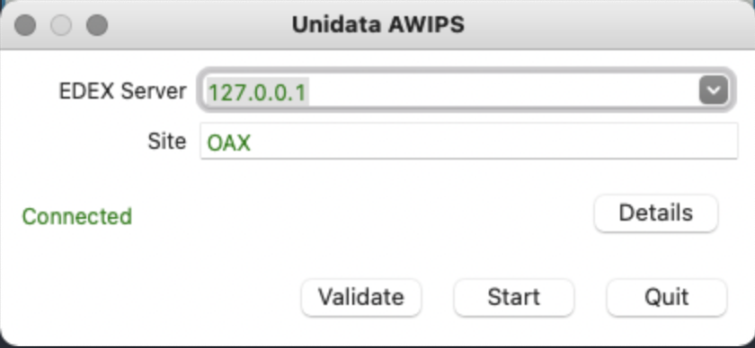

# AWIPS EDEX Server Docker Container

This repository contains files necessary to build and run a [Unidata AWIPS EDEX Data Server](https://www.unidata.ucar.edu/software/awips2/) inside a Docker container.

## Quick Start

Download and install Docker and Docker Compose:

* [Docker for CentOS 7 Linux](https://docs.docker.com/install/linux/docker-ce/centos/)
* [Docker for Mac](https://docs.docker.com/docker-for-mac/)
* [Docker for Windows](https://docs.docker.com/docker-for-windows/install/)
* [docker-compose](https://docs.docker.com/compose/) (it should be bundled with Docker by default on Mac and Windows)

Clone this repository

    git clone https://github.com/Unidata/edex-docker.git
    cd edex-docker

Run the container with docker-compose 

    docker-compose up -d edex_server

Confirm the container is running

    docker ps -a 

Enter the container

    docker exec -it edex_server bash    

Stop the container

    docker-compose down

Delete the container (keep the image)

    docker-compose rm -f
    
Run commands inside the container, such as

    docker exec edex-ingest edex

which should return something like

    [edex status]
         postgres    :: running :: pid 355
         pypies      :: running :: pid 398
         qpid        :: running :: pid 441
         EDEXingest  :: running :: pid 853 1236
         EDEXgrib    :: not running
         EDEXrequest :: running :: pid 815 1249
         ldmadmin    :: running :: pid 1169

If configuration files are modified in the `aux` folder, run
    
    docker-compose build

to have the Docker container reflect the changes. [This Docker documentation](https://docs.docker.com/compose/reference/build/) has some information on rebuilding. If changes are made to the configuration files but are not reflected in the Docker container, sometimes it is useful to run

    docker-compose build --no-cache

which will rebuild the container images completely. Beware this may take a long time. 

Connect with the [CAVE](http://unidata.github.io/awips2/install/install-cave/) client by selecting `localhost` or `127.0.0.1` for the EDEX server in the CAVE Localization settings.

## Docker Requirements

In general, the Docker memory/CPU/hard disk requirements are contingent on the amount of data the EDEX server will be used to ingest/process. Using the default included `ldmd.conf` file, good results were achieved by giving Docker 4 CPU cores, 16GB RAM, and 200GB of hard disk space. 

## Customizable Files

- `aux/ldmd.conf`

    Defines which data feeds to receive. By default the container is setup to only ingest two channels of GOES data so as to not overwhelm small EDEX containers ingesting large volumes of radar and gridded data files.
 
## Upstream Data Feed for the LDM

The LDM operates on a push data model. You will have to find an institution who will agree to push you the data you are interested in. If you are part of the academic community please send a support email to `support-idd@unidata.ucar.edu` to discuss your LDM data requirements.

## Support

If you have a question or would like support for this EDEX Ingest Docker container, consider [submitting a GitHub issue](https://github.com/Unidata/edex-docker/issues). Alternatively, you may wish to start a discussion on the AWIPS Community mailing list: <awips2-users@unidata.ucar.edu>.

For general AWIPS questions, please see the [Unidata AWIPS page](https://www.unidata.ucar.edu/software/awips/).
